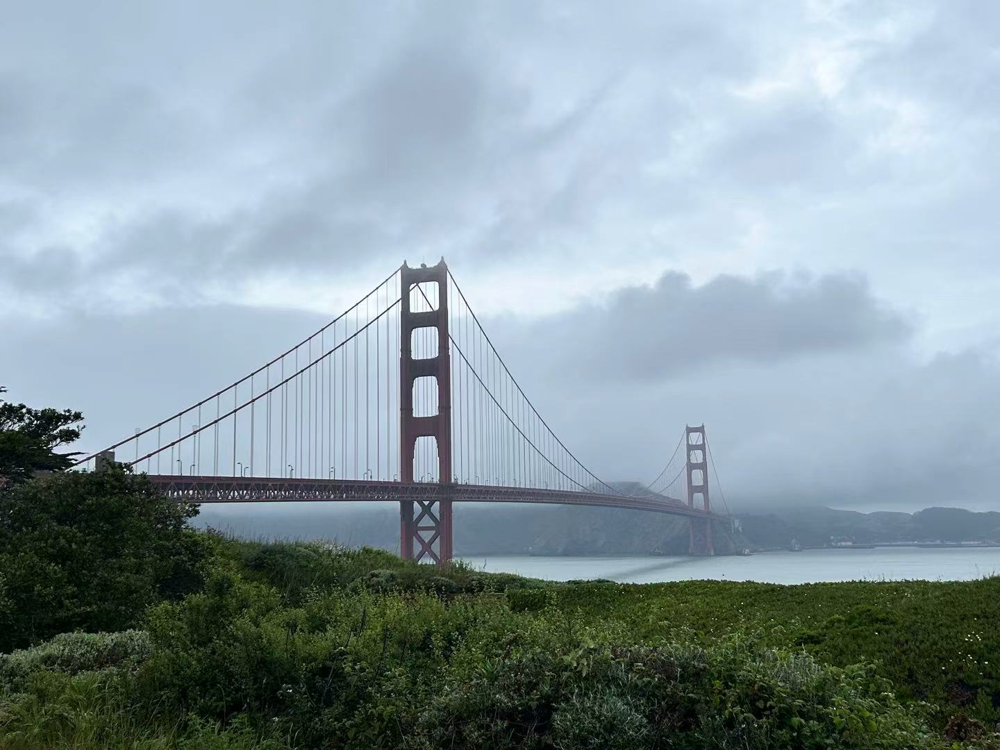
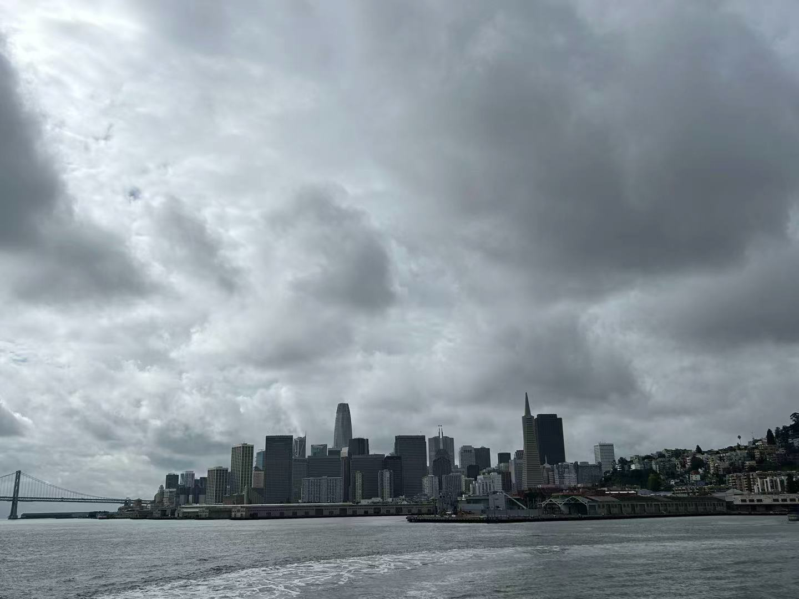
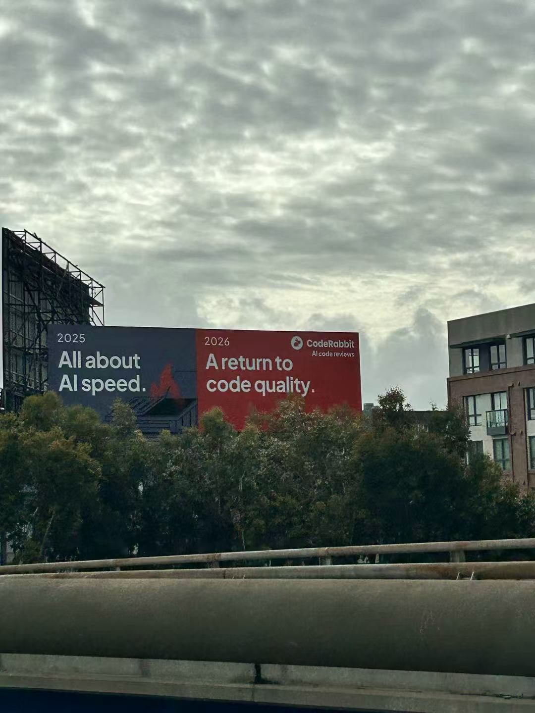

date: 2026-03-04

# Fire from Silicon Valley

## From Manhattan to the Valley: A Crossroads at 125th Street

By chance, I attended an AI workshop at Columbia University last week. It left me with a whirlwind of emotions. On one hand, I was awestruck by the current success and future potential of AI; on the other, I found myself standing once again at a major crossroads in my life. I found myself questioning my judgment—wondering if this is just a fleeting whim, if my limited and perhaps shallow perspective can sustain such a grand dream, or if I can truly catch this massive AI wave.

I remember back in my second year of middle school, my roommate brought a copy of Walter Isaacson’s Steve Jobs. It was a thick book, and because my boarding school had very little entertainment, I read everything I could get my hands on. I was instantly hooked. I finished that biography in less than a week, right there in the classroom. That was my first introduction to Silicon Valley and Apple. Later, through Lei Jun’s biography, I discovered Fire in the Valley. I began to feel a deep yearning for the Bay Area. In the summer of 2018, that same year, I joined a summer camp to California. Although we only stayed in Silicon Valley for half a day—and I don’t have many distinct memories of that afternoon—I remember the names Google, IBM, and Intel always had a special "filter" in my mind. I hoped that one day, I could change the world like these great companies.

But when it came time for college, I chose to major in Accounting. I’m not sure if my passion was largely worn down by three years of high school, if it wasn't strong enough to begin with, or if I am simply too fickle. Silicon Valley became like a close friend from high school with whom I lost touch after entering university. The names of tech giants were gradually replaced by KPMG, JP Morgan, and PwC. Although I still occasionally dabbled in my interests—registering for GPT back in 2022, building my own PC to run Stable Diffusion locally, experimenting with Ollama for local LLM fine-tuning, and taking electives in Machine Learning—I never really picked up that dream of going to Silicon Valley again.

I had gradually accepted a life in accounting. Looking at the skyscrapers of Midtown Manhattan, I thought about doing audit at a "Big Four" firm and eventually pivoting into Investment Banking. I knew I could make a lot of money and live the life I wanted. Accounting is a safe path, perhaps the most reliable route to securing an H1B visa. I don't hate accounting, but I seem to have forgotten that I have things I truly love. I even hesitated between choosing an MSBA (Business Analytics) or an MSA (Accounting) at UIUC, wanting to trade a one-year Master's and a CPA for a chance to stay in the U.S. Perhaps I am no longer that young boy; I am certainly not one of the "crazy ones" Jobs spoke of—the people who think they can change the world. I was becoming more and more like a typical accountant: shrewdly calculating every step of my life, measuring companies by financial data and ROI rather than the ideas behind them.

Today, a week later, I still find it hard to pin down exactly which part of that workshop touched me so deeply. I saw the infinite potential of "vibe coding." I saw how AI agents from startups might reshape entire industries, potentially replacing 90% of programmers. I saw investors from New York and Silicon Valley deep in conversation, while I couldn't find a way to join in. I felt a pang of regret for my perceived lack of achievement over the past four years, yet I felt a surge of joy for the possibilities AI could bring me.

When I walked out of Columbia Business School that day, the sunset was spilling over the Hudson River and 125th Street. New York was as bustling as ever, a city I still admire. But I had only one thought in my mind: I want to see Silicon Valley. I chose the MSBA program because I want to become a Silicon Valley investor. I know the road is long and difficult. I don't even have a solid plan yet—only a vision. But at that moment, the urge was undeniable.

So, I bought a plane ticket to San Francisco for March 31st. I am still looking forward to what that land of "misfits and geeks" might show me.

March 4, 2026, New York